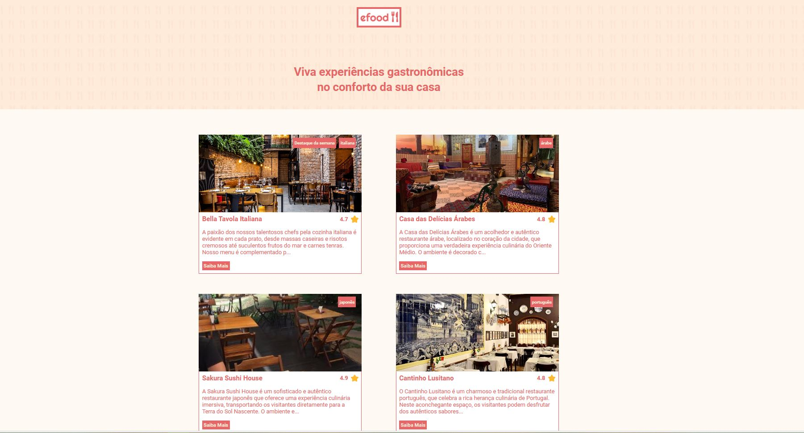

<h1>Descrição do projeto:</h1>
Estou muito empolgado em compartilhar o meu projeto final de front-end, foram 20 dias trabalhando nesse projeto, e foi um grande desafio! 💡

Durante o curso de desenvolvimento fullstack da EBAC, perpassei por diversas tecnologias front-end, para no final integrar os principais conhecimentos em um único projeto: uma interface que reúne diversos restaurantes e diferentes pratos, com categorias, carrinho, página de checkout e finalização de pedido. O resultado é um projeto que me enche de orgulho. 💻

Utilizei React Router Dom para a navegação, implementei esquemas de validação para o formulário com Yup, Formik e InputMask para garantir que os formulários funcionassem bem. E para manter tudo organizado e eficiente, contei com o Redux para gerenciar os estados globais. ✨

E para finalizar adotei styled-components para o CSS, criando interfaces com eficiência e responsividade. E o coração do projeto? TypeScript com React.js, que me proporcionou um ambiente de desenvolvimento mais seguro e produtivo. 🎯

Nesse processo, aprendi muito, superei desafios e, acima de tudo, me diverti explorando o mundo do front-end. Este projeto é o resultado de muito esforço e dedicação. 🙌

<h2>
    Pré-visualização
 </h2>

<h1>Visualização Online</h1>
A landing page do projeto está disponível para visualização na Vercel. Você pode acessá-la através do seguinte link:
Página com informações do Github: https://efood-eta.vercel.app/

## Skills utilizadas:

 
  
  
  
  
  
  
   
